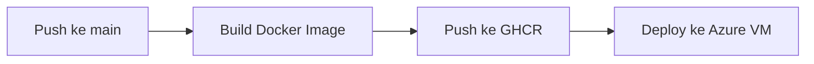

# 🚀 Portofolio Fauzan Wahyu Mubarak

[](http://128.85.33.49:8080)
[](https://ghcr.io/FauzanWahyuM/web-portofolio)

Portofolio profesional yang menampilkan karya, keterampilan, dan pengalaman saya sebagai **Software Engineer**. Dibangun dengan stack modern dan dideploy secara otomatis menggunakan CI/CD.

---

## ✨ Fitur Utama

| Kategori       | Deskripsi                                                                 |
|----------------|---------------------------------------------------------------------------|
| **Responsive**  | Tampilan optimal di desktop, tablet, dan mobile                          |
| **Performant**  | Load cepat berkat optimasi asset dan lazy loading                        |
| **Modern UI**   | Desain bersih dengan animasi mikro interaktif                            |
| **CI/CD**       | Deploy otomatis ke Azure VM via GitHub Actions                           |
| **Containerized**| Siap produksi dengan Docker                                              |

---

## 🛠 Tech Stack

### Frontend


### DevOps


---

## 🏃‍♂️ Menjalankan Proyek

### 🔧 Lokal Development
```bash
# 1. Clone repositori
git clone https://github.com/FauzanWahyuM/Web-Portofolio.git
cd Web-Portofolio

# 2. Install dependencies
npm install

# 3. Jalankan development server
npm run dev
```

### 🐳 Dengan Docker
```bash
# Build image
docker build -t web-portfolio .

# Jalankan container
docker run -dp 8080:80 web-portfolio
```
Akses di: http://localhost:8080

---

## ⚙️ CI/CD Pipeline

Proyek ini menggunakan GitHub Actions untuk alur otomatis:


**Detail Workflow**:
- Trigger: Push/Pull Request ke branch `main`
- Langkah:
  1. Build Docker image
  2. Push ke GitHub Container Registry (GHCR)
  3. SSH ke Azure VM untuk update container

---

## 🌐 Deployment

Situs ini dideploy di **Azure Virtual Machine** dengan konfigurasi:
- OS: Ubuntu Server 22.04 LTS
- Port: 80 (HTTP)
- Reverse Proxy: Nginx

---

## 📬 Kontak

| Platform       | Link                                                                 |
|----------------|----------------------------------------------------------------------|
| 📧 Email       | [fauzanwahyumubarak@gmail.com](mailto:fauzanwahyumubarak@gmail.com) |
| 💼 LinkedIn   | [Fauzan Wahyu Mubarak](https://linkedin.com/in/your-profile)        |
| 🐱 GitHub     | [@FauzanWahyuM](https://github.com/FauzanWahyuM)                    |

---

Dibangun dengan ❤️ oleh Fauzan Wahyu Mubarak | © 2025


